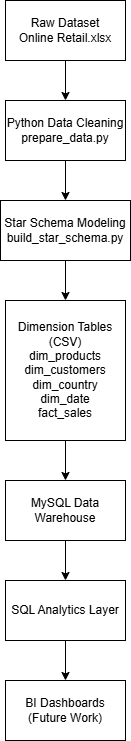

# Ecommerce Data Warehouse & Analytics Project

## Project Overview

This project simulates a real-world **data analytics workflow** by transforming raw transactional data into a structured **data warehouse** designed for business intelligence and analytical queries.

The goal of this project is to demonstrate how raw operational data can be transformed into a structured model that supports business decision-making.

The project covers the full analytics pipeline:

Raw Data → Data Cleaning → Data Modeling → Data Warehouse → Business Analysis

---

## Business Case

This project is based on a simulated e-commerce analytics scenario.

The full business context and objectives can be found here:

[View the Business Case](business_case.md)

---

## Key Business Insights

Using the data warehouse and SQL analytics layer, several key insights can be extracted from the e-commerce dataset.

### Revenue Performance

The platform generates revenue across multiple international markets. By aggregating sales by country, it is possible to identify which regions contribute the most to total revenue and where expansion opportunities may exist.

### Product Performance

Analysis of product sales reveals that a small subset of products drives the majority of sales volume and revenue. This suggests the presence of high-demand products that may benefit from inventory prioritization and targeted promotions.

### Customer Value

Customer lifetime value analysis shows that a limited number of customers contribute significantly to total revenue. Identifying and retaining these high-value customers is essential for long-term profitability.

### Customer Retention

By comparing repeat customers versus one-time buyers, the dataset allows the measurement of customer retention. A higher proportion of repeat buyers indicates stronger customer loyalty and healthier long-term growth.

### Sales Trends Over Time

Monthly revenue trends allow the business to identify seasonality patterns and periods of increased demand, enabling better planning for inventory, marketing campaigns, and staffing.

---

## Data Pipeline Architecture

The project simulates a simplified modern analytics workflow, transforming raw transactional data into a structured warehouse for analysis.



---

## Dataset

The project uses the **Online Retail dataset**, which contains transactions from a UK-based e-commerce store.

Main attributes include:

- Invoice number
- Product code and description
- Quantity purchased
- Unit price
- Customer ID
- Country
- Invoice date

The dataset contains over **540,000 transactions**, making it suitable for simulating a real analytical workload.

---

## Architecture

The project follows a simplified modern analytics workflow:

Raw Dataset (Excel)
↓
Python Data Cleaning
↓
Star Schema Modeling
↓
MySQL Data Warehouse
↓
SQL Analytics Queries
↓
BI Visualization (future step)

This architecture mirrors the structure used in many real data teams where data is transformed into analytical models before being consumed by BI tools.

---

## Data Model

The data warehouse follows a **Star Schema design**, which separates transactional data into a central fact table and multiple dimension tables.


The star schema separates transactional data into a **central fact table** containing measurable business events and multiple **dimension tables** that provide descriptive context.

This structure improves analytical performance and simplifies SQL queries used for reporting and dashboards.

### Fact Table

**fact_sales**

Contains transactional sales data.

Columns:

- invoice_no
- product_id
- customer_id
- date_id
- country_id
- quantity
- unit_price
- revenue

### Dimension Tables

**dim_products**

- product_id
- stockcode
- description

**dim_customers**

- customer_id

**dim_country**

- country_id
- country

**dim_date**

- date_id
- date
- year
- month
- day
- weekday

---

## Tech Stack

This project uses a combination of data engineering and analytics tools:

- Python
- Pandas
- MySQL
- SQL
- Git / GitHub

Future improvements may include:

- Power BI or Tableau dashboards
- dbt transformations
- Cloud data warehouse (Redshift / BigQuery / Snowflake)

---

## Project Structure

```
ecommerce-data-platform
│
├── assets
│   ├── pipeline_architecture.png
│   └── star_schema_ecommerce.png
│
├── datasets
│   └── sample
│       └── fact_sales_sample.csv
│
├── python
│   ├── prepare_data.py
│   ├── build_star_schema.py
│   ├── fix_customers_csv.py
│   ├── profile_data.py
│   └── fact_sales_sample.py
│
├── sql
│   ├── create_tables.sql
│   └── business_queries.sql
│
├── business_case.md
└── README.md
```

---

## Key Business Questions

The data warehouse enables answering several analytical questions relevant for business decision-making:

- Which countries generate the highest revenue?
- Which products contribute most to sales?
- Who are the highest-value customers?
- How does revenue evolve over time?
- What are the monthly sales trends?

---

## Example Analytical Query

Example query to calculate revenue by country:

```sql
SELECT
c.country,
SUM(f.revenue) AS revenue
FROM fact_sales f
JOIN dim_country c
ON f.country_id = c.country_id
GROUP BY c.country
ORDER BY revenue DESC;
```

This query demonstrates how the star schema simplifies analytical queries by joining fact and dimension tables.

---

## Future Improvements

The following improvements will extend the project toward a modern analytics stack:

- Build a BI dashboard using **Power BI or Tableau**
- Implement transformations using **dbt**
- Deploy the warehouse in a **cloud environment**
- Automate the data pipeline

---

## Author

Eugenio Quintero
Data Analyst & Data Engineering Projects
