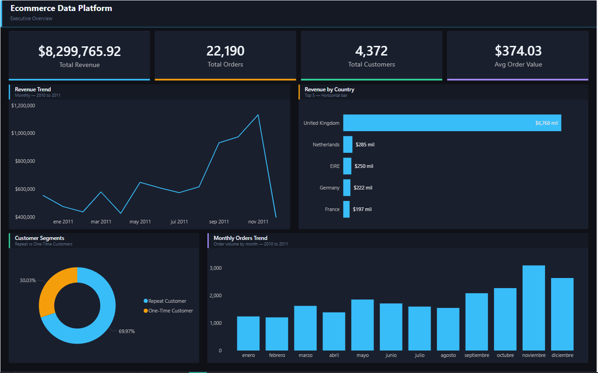
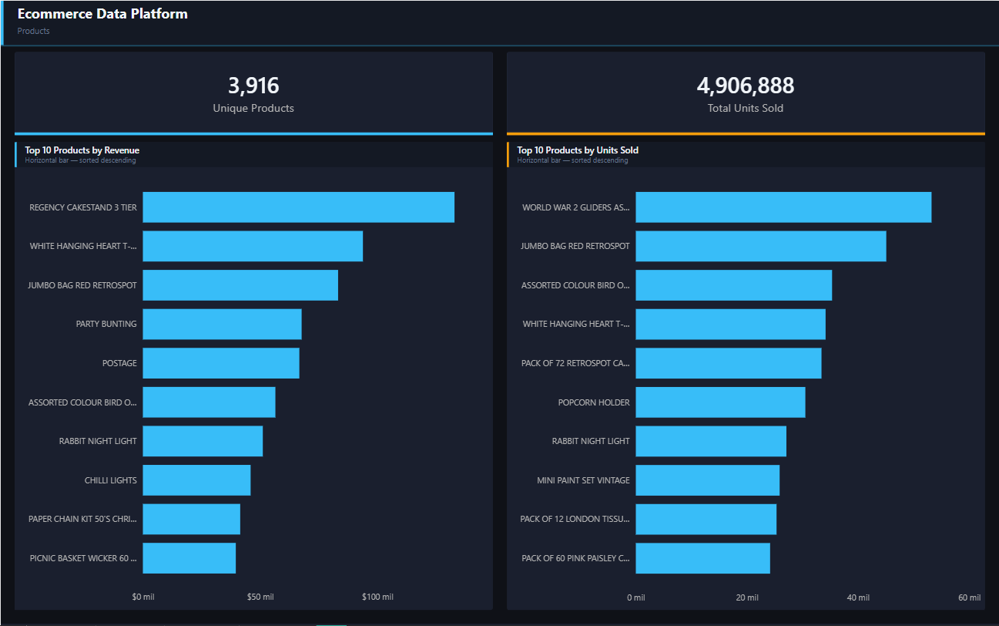
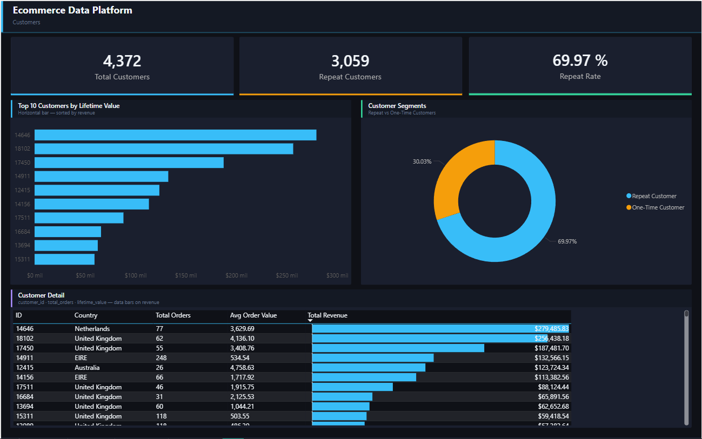
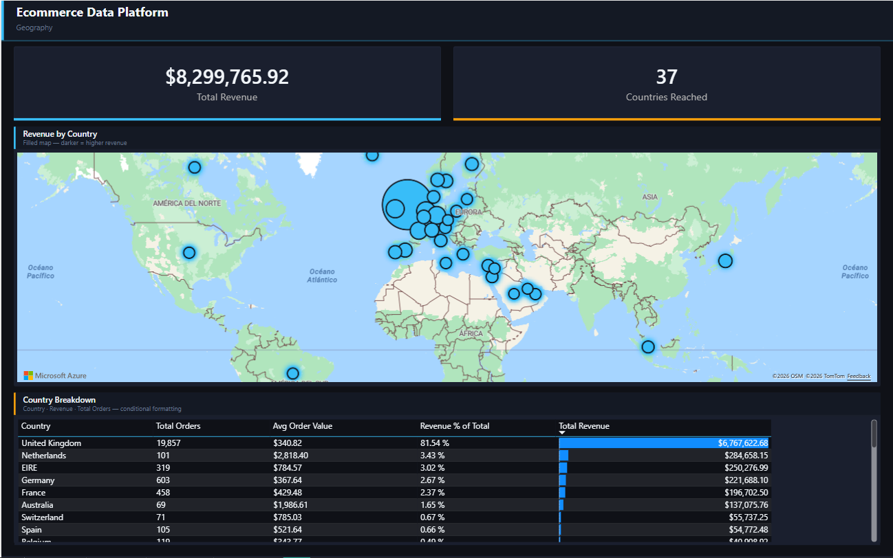
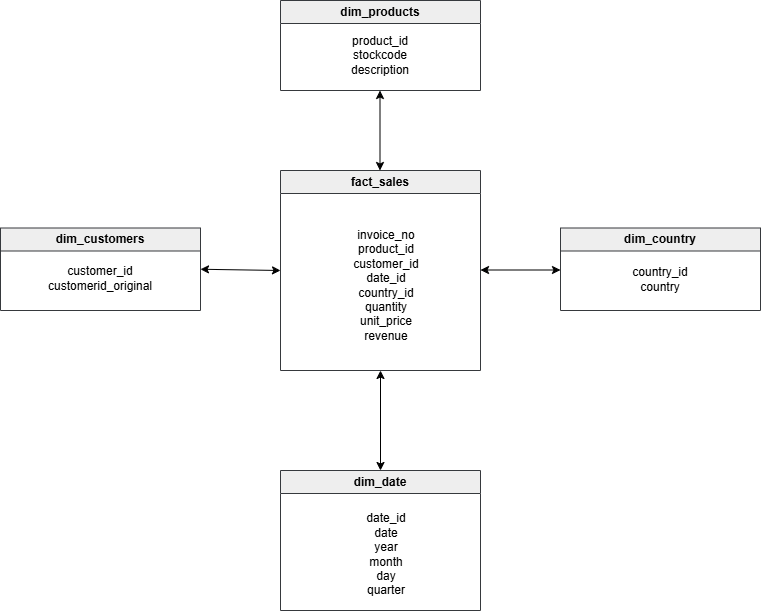

# Ecommerce Data Warehouse & Analytics Project

## Project Overview

This project simulates a real-world **data engineering and analytics workflow** by transforming raw transactional data into a structured **cloud data warehouse** designed for business intelligence and analytical queries.

The project covers the full pipeline:

Raw Data → Data Cleaning → Star Schema Modeling → S3 (Data Lake) → Redshift (Data Warehouse) → SQL Analytics → Power BI Dashboard

---

## Dashboard

### Executive Overview


### Products


### Customers


### Geography


---

## Business Case

This project is based on a simulated e-commerce analytics scenario.

The full business context and objectives can be found here:

[View the Business Case](business_case.md)

---

## Architecture

```
datasets/raw/online_retail.xlsx
        ↓  prepare_data.py
datasets/raw/orders.csv
        ↓  build_star_schema.py
datasets/processed/
  dim_products.csv
  dim_customers.csv
  dim_country.csv
  dim_date.csv
  fact_sales.csv
        ↓  load_to_redshift.py
Amazon S3 — s3://ecommerce-data-platform-eugenioqs-2026/star-schema/
        ↓  COPY command
Amazon Redshift Serverless (dev database)
  dim_products   — 3,916 rows
  dim_customers  — 4,372 rows
  dim_country    — 37 rows
  dim_date       — 305 rows
  fact_sales     — 406,829 rows
        ↓  run_queries.py / Power BI
SQL Analytics + Power BI Dashboard (4 pages)
```

---

## Data Model

The data warehouse follows a **Star Schema design**.



### Fact Table

**fact_sales** — 406,829 transactional records

| Column | Type |
|--------|------|
| invoice_no | VARCHAR(20) |
| product_id | INT |
| customer_id | INT |
| country_id | INT |
| date_id | INT |
| quantity | INT |
| unit_price | DECIMAL(10,2) |
| revenue | DECIMAL(10,2) |

### Dimension Tables

| Table | Key Column | Rows |
|-------|-----------|------|
| dim_products | product_id | 3,916 |
| dim_customers | customer_id | 4,372 |
| dim_country | country_id | 37 |
| dim_date | date_id | 305 |

---

## Tech Stack

| Layer | Technology |
|-------|-----------|
| Data Processing | Python, Pandas |
| Data Lake | Amazon S3 |
| Data Warehouse | Amazon Redshift Serverless |
| Analytics | SQL |
| Dashboard | Power BI |
| Version Control | Git / GitHub |

---

## Key Business Insights

### Revenue Performance
- **Total Net Revenue: $8.3M** (includes returns/cancellations with negative revenue)
- **United Kingdom** dominates with $6.8M revenue — 10x the next country (Netherlands at $285K)
- Top product by revenue: **REGENCY CAKESTAND 3 TIER** at $132K

### Customer Behavior
- **70% of customers are repeat buyers** (3,059 repeat vs 1,313 one-time)
- Average order value: **$374**
- Top customer (ID 14646): $279K lifetime value across 77 orders

### Sales Trends
- Revenue peaks in **Q4** — November 2011 was the highest month at $1.1M
- Clear seasonality: sales accelerate from September through November

---

## Project Structure

```
ecommerce-data-platform/
│
├── assets/
│   ├── pipeline_architecture.png
│   └── star_schema_ecommerce.png
│
├── datasets/
│   └── sample/
│       └── fact_sales_sample.csv
│
├── powerbi/
│   ├── ecommerceBI.pbix            # Power BI dashboard (4 pages)
│   ├── ecommerce-theme.json        # Dark theme
│   ├── template-executive.svg      # Executive Overview background
│   ├── template-products.svg       # Products background
│   ├── template-customers.svg      # Customers background
│   ├── template-geography.svg      # Geography background
│   └── design-guide.md             # Design system reference
│
├── python/
│   ├── prepare_data.py             # Excel → CSV
│   ├── build_star_schema.py        # CSV → Star Schema
│   ├── load_to_redshift.py         # S3 + Redshift load
│   └── run_queries.py              # Business analytics queries
│
├── sql/
│   ├── create_tables.sql           # Redshift DDL
│   └── business_queries.sql        # 10 analytical queries
│
├── business_case.md
└── README.md
```

---

## How to Run

### 1. Install dependencies
```bash
pip install pandas openpyxl redshift-connector boto3
```

### 2. Configure AWS credentials
```bash
aws configure
```

### 3. Run the pipeline
```bash
cd python
python prepare_data.py        # Convert Excel to CSV
python build_star_schema.py   # Build star schema CSVs
python load_to_redshift.py    # Upload to S3 and load into Redshift
python run_queries.py         # Run business analytics queries
```

### 4. Power BI Dashboard
- Open `powerbi/ecommerceBI.pbix`
- Connect to Redshift Serverless using database credentials
- Theme is pre-configured via `ecommerce-theme.json`

---

## Author

Eugenio Quintero
Data Analyst & Data Engineering Projects
